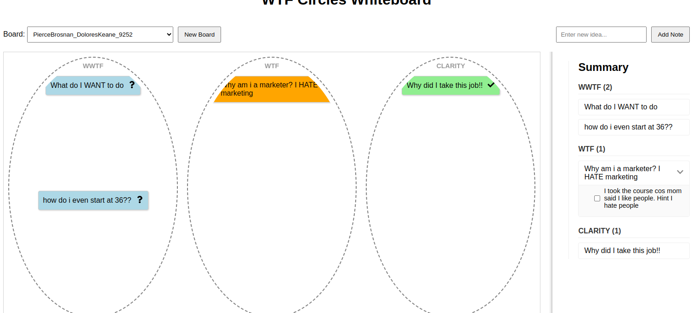

# WTF Circles

*A clarity tool for when you're totally, utterly clueless.*
---

## **Most Things We Haven’t Really Looked At**

We go through life labeling things:  
“This is a project.”  
“This is a problem.”  
“This is a goal I have.”

But most of the time, those labels are just placeholders for *things we haven’t examined deeply.*

We *think* we know what something is—  
but really, we’re standing on layers of vague assumptions.

> You’re not stuck because it’s hard.  
> You’re stuck because you haven’t figured out what it even is.

WTF Circles exists to bring that moment forward.  
To **create a space where you admit you don’t know what you’re looking at yet**.  
That’s the shift.

From "I'm overwhelmed and frozen,"  
to: "Okay… what even *is* this?"

Once you’ve named that, you can start breaking it down.  
Not into solutions.  
Into **understandings**.  
Into **first principles**.  
Into the first honest, doable action that moves you *toward* clarity.

It’s not about pretending to know.  
It’s about finally admitting that you don’t.  
And building from there.

That’s not weakness.  
That’s how all clarity starts.

---

WTF Circles is a first principles approach to breaking down what we are not clear about. It is an interactive whiteboard tool and process designed to help you and your teams capture the things you’re truly clueless about—and then start a process of bringing clarity step by step. Whether you're planning a project, navigating personal relationships, or simply sorting through ideas, this tool gives you a visual method to move from confusion to understanding. It's not project management, it's more first principles. It's about asking why. 

WTF Circles *can* be compared to a trello board, but a trello board assumes you have a a clue :) This starts from WTF??? IS THIS THING

---

## Problem Statement

We all have areas in life where we’re uncertain, overwhelmed, or simply clueless about what’s important. Traditional organization tools are often uncomfortable with uncertainty and jump straight to workshops and project management in   a linear approach, which can bury assumptions deep before anyone realizes.  WTF Circles solves this by letting you capture raw, unclear ideas and then, through actionable steps, gradually refine them into clear, confident thoughts. It’s a system that works not just for work or creativity but for any aspect of life—from planning projects to resolving personal dilemmas.

---

## sample implementation
You can use Miro, or any whiteboard physical or otherwise.
Here's a sample implementation that's very basic but works.


## How It Works

WTF Circles features three concentric circles that represent different levels of clarity:

- **Outer Circle (WWTF):**  
Aka "Wait, wait WHAT THE KFC IS THIS!!!!!!"
  This is where those things you’re completely clueless about live. It could be your own idea or project, a project handed to you, or a situation you are in.  They start off with a cool blue background and a question mark icon.
These things are:
Unknown unknowns
Completely clueless things
No idea where to start or what even this is.
I know what is is but absolutely no clue where to start - at all.
Just honestly lost, and prepared to admit it. 

### What you do with WWTF 
Brainstorm on these. Do 5 whys. Stare at them. keep asking 'What the f**k is this??'
Click on them to add next DOABLE actions to bring clarity. Remember you are not doing a task you are just trying to get a bleeding clue as to what this is. It could be a task but the goal is the firt thing that can help unlock.

- **Middle Circle (WTF):**  
  As you add next actionable steps to a WWTF sticky note, to start getting to clarity (but still clueless0 it moves here. This zone represents ideas that are in the process of becoming clear. The note’s style updates (e.g., turns orange with a “WTF” label) to reflect progress.


- **Inner Circle (Clarity):**  
  When a sticky note has accumulated enough actionable steps and clarity, you move it to the inner circle. Here, it appears in green with a checkmark, symbolizing that the idea is clear and ready to be acted on.
You could then move the clarity stuff into a task or proejct management. 

### Next Actions Panel

- **Interactive Next Steps:**  
  Click on any sticky note to reveal a next actions panel where you can add specific, actionable steps to help clarify the idea.
- **Step-by-Step Clarity:**  
  As you add and eventually complete these next actions, you can drag the note inward—from WWTF to WTF, and finally to Clarity.

---

## Scenario Walkthrough

Imagine you’re facing a challenging decision about your career, a new project, or even a personal relationship. Here’s how WTF Circles guides you:

1. **Capture the Uncertainty:**  
   Start by jotting down your vague thoughts as sticky notes in the outer circle (WWTF). For instance, “Am I making the right choice about my career?”

2. **Add Actionable Steps:**  
   Click on the note to open the next actions panel and list steps such as:
   - List pros and cons.
   - Research industry trends.
   - Talk to a mentor.
   
   With these steps added, the note shifts to the middle circle (WTF) with a warm orange tone and a “WTF” label.

3. **Achieve Clarity:**  
   Once enough actions have been defined and checked off, the note moves into the inner circle (Clarity), transforming to green with a checkmark—signaling that you’ve moved from cluelessness to clear, actionable insight.

---

Exactly! That’s the real gold of WTF Circles — embracing the **messiest, most human WTFs**. Not every confusion is tidy or logical. Some are **emotional, subconscious, or even absurd**, and that’s where this tool stands out from linear planners.

Let me remix the examples to include more *true* WWTF-level chaos 👇

---

## 🔥 7 Real-World Use Cases Featuring **True WTF Moments**

---

### 🧠 1. **Personal Identity Crisis**
**Use case:** _“Why do I want this job?”_

- **WWTF:**  
  “Do I even *want* this or am I just afraid to be broke?”  
  “Is it about the role or the title?”  
  “Why did I light up in the interview, but feel dead afterward?”
- **WTF:**  
  → Journal about what “success” means to you right now  
  → Ask someone who knows you what they'd picture you doing  
  → Explore what's exciting vs. what's a coping mechanism
- **Clarity:**  
  You realize it was status-hunger masked as passion, and now you can choose from truth.

---

### 😱 2. **Fear of Starting Something**
**Use case:** _“Why am I afraid to start this creative project?”_

- **WWTF:**  
  “What am I even scared of? Failing? Being seen?”  
  “I’ve said I want to do this for years—why haven’t I?”  
  “Do I actually want this or just the idea of it?”
- **WTF:**  
  → Write the worst-case scenario and see if it’s survivable  
  → Record a 1-minute version of the idea with no stakes  
  → Talk it out with someone who won’t judge
- **Clarity:**  
  You uncover a fear of visibility, not ability—and take the first small step with ease.

---

### 🇵🇱 3. **Political Regret Spiral**
**Use case:** _“Why did I vote for this guy!?”_

- **WWTF:**  
  “Was I just mad that day?”  
  “Did I get manipulated by vibes and memes?”  
  “Was I projecting my hopes onto someone who didn’t earn them?”
- **WTF:**  
  → Rewatch their campaign messages  
  → Read opposing views without defensiveness  
  → Reflect on what emotional need was being met at the time
- **Clarity:**  
  You see it wasn’t about policy—it was a desire to burn it all down. Now you get curious, not just cynical.

---

### 💼 4. **Workplace Confusion**
**Use case:** _“Why do I feel weird in every meeting lately?”_

- **WWTF:**  
  “Am I out of place here?”  
  “Do I hate my job or just Zoom fatigue?”  
  “What changed—me or the team?”
- **WTF:**  
  → Track your energy after different meetings  
  → Talk to someone you trust at work  
  → Revisit your reasons for staying
- **Clarity:**  
  You realize you’ve mentally quit, but your body hasn’t caught up. Now you can decide what's next.

---

### 🧪 5. **Innovation Fog**
**Use case:** _“We should use AI for this… but for what exactly?”_

- **WWTF:**  
  “Everyone’s doing it, but I can’t articulate what *we* need.”  
  “Is this just FOMO?”  
  “What would this even replace or enhance?”
- **WTF:**  
  → List your top 5 workflows  
  → Ask: where is the biggest bottleneck or most repetitive task?  
  → Try a one-off GPT experiment on real data
- **Clarity:**  
  You find a perfect pilot use case—no buzzwords, just better flow.

---

### 🫂 6. **Relationship Drift**
**Use case:** _“Why do I feel distant from my partner?”_

- **WWTF:**  
  “Are they changing—or am I?”  
  “Why does small talk feel so hard lately?”  
  “What am I afraid to say?”
- **WTF:**  
  → Write a letter you don’t send  
  → Track the last 5 moments of joy or conflict  
  → Ask them: “What’s one thing you miss from early days?”
- **Clarity:**  
  You realize you’re stuck in logistics mode. Time to reconnect.

---

### 🏘️ 7. **Community Overwhelm**
**Use case:** _“Why did I volunteer for this committee!?”_

- **WWTF:**  
  “Did I do this out of guilt?”  
  “Do I actually care about this cause?”  
  “Is this me avoiding my own stuff by being ‘helpful’?”
- **WTF:**  
  → Reflect on what made you say yes  
  → Check how you feel after each meeting  
  → Talk to another committee member
- **Clarity:**  
  You realize you joined to belong—not to serve. That insight helps you realign or step out.

---
 

## Current Features

- **Three Concentric Circles:**  
  Visually distinguish between raw uncertainty, partial clarity, and complete understanding.
- **Sticky Notes:**  
  Capture any thought or idea that you feel clueless about.
- **Next Actions Panel:**  
  Click on a sticky note to add specific steps that help bring clarity.
- **Visual Feedback:**  
  As sticky notes are dragged inward, they change colour and icons (blue with a question mark → orange “WTF” → green with a checkmark).
- **Local Storage:**  
  The app currently uses local storage to save your session data.

---

## Future Plans

- **Persistent Storage:**  
  Implement a back-end system for permanent data storage.
- **Team Collaboration:**  
  Allow users to share and collaboratively work on WTF Circles in real-time.
- **Enhanced UX/UI:**  
  Refine the interface for a more intuitive and visually appealing experience.
- **Markdown Export:**  
  Enable exporting of sticky note summaries and next actions as Markdown files.

---

## Getting Started

### Prerequisites

- Modern web browser
- Node.js and npm (for local development)

### Installation

1. **Clone the repository:**

   ```
   git clone https://github.com/yourusername/wtf-circles.git
   cd wtf-circles
   ```

2. **Install dependencies:**

   ```
   npm install
   ```

3. **Run the application:**

   ```
   npm start
   ```

   The app will be available at [http://localhost:3000](http://localhost:3000).

---

## Contributing

Contributions are welcome! If you have suggestions, bug fixes, or new features, please open an issue or submit a pull request. Follow our coding guidelines and include tests where possible.

---

## License

This project is licensed under the MIT License. See the [LICENSE](LICENSE) file for details.

---

## Contact

For questions, suggestions, or collaboration opportunities, please reach out at [calendly.com/.](https://calendly.com/colmbyrne)

---

WTF Circles empowers you to embrace your uncertainty and turn it into actionable clarity. Whether for work, relationships, or any area of life, capture what you’re clueless about and watch as it transforms into clear, focused insight—one sticky note at a time.
 HEAD
# React + TypeScript + Vite

This template provides a minimal setup to get React working in Vite with HMR and some ESLint rules.

Currently, two official plugins are available:

- [@vitejs/plugin-react](https://github.com/vitejs/vite-plugin-react/blob/main/packages/plugin-react/README.md) uses [Babel](https://babeljs.io/) for Fast Refresh
- [@vitejs/plugin-react-swc](https://github.com/vitejs/vite-plugin-react-swc) uses [SWC](https://swc.rs/) for Fast Refresh

## Expanding the ESLint configuration

If you are developing a production application, we recommend updating the configuration to enable type-aware lint rules:

```js
export default tseslint.config({
  extends: [
    // Remove ...tseslint.configs.recommended and replace with this
    ...tseslint.configs.recommendedTypeChecked,
    // Alternatively, use this for stricter rules
    ...tseslint.configs.strictTypeChecked,
    // Optionally, add this for stylistic rules
    ...tseslint.configs.stylisticTypeChecked,
  ],
  languageOptions: {
    // other options...
    parserOptions: {
      project: ['./tsconfig.node.json', './tsconfig.app.json'],
      tsconfigRootDir: import.meta.dirname,
    },
  },
})
```

You can also install [eslint-plugin-react-x](https://github.com/Rel1cx/eslint-react/tree/main/packages/plugins/eslint-plugin-react-x) and [eslint-plugin-react-dom](https://github.com/Rel1cx/eslint-react/tree/main/packages/plugins/eslint-plugin-react-dom) for React-specific lint rules:

```js
// eslint.config.js
import reactX from 'eslint-plugin-react-x'
import reactDom from 'eslint-plugin-react-dom'

export default tseslint.config({
  plugins: {
    // Add the react-x and react-dom plugins
    'react-x': reactX,
    'react-dom': reactDom,
  },
  rules: {
    // other rules...
    // Enable its recommended typescript rules
    ...reactX.configs['recommended-typescript'].rules,
    ...reactDom.configs.recommended.rules,
  },
})
```
 


